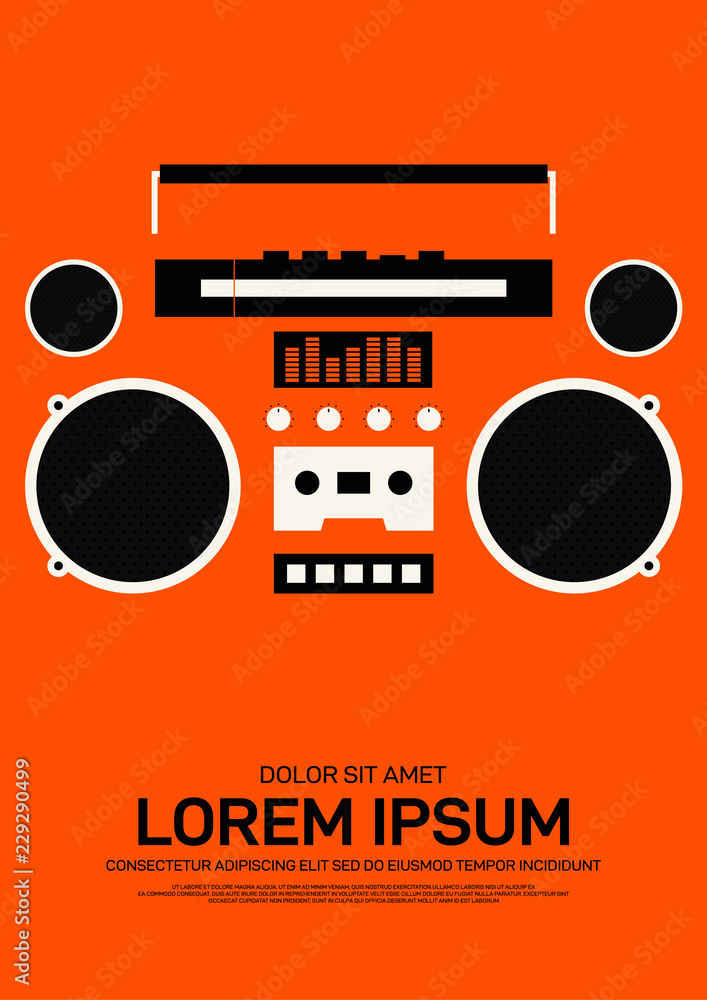
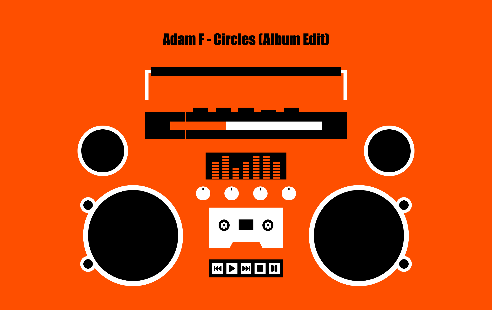
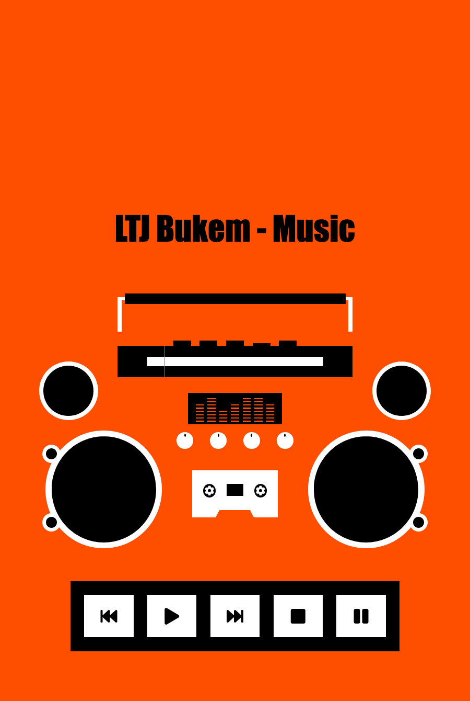

# Portfolio Project: Boombox

This is a fun little music player I created which uses the HTML 5 audio API.

## Table of contents

- [Overview](#overview)
  - [The challenge](#the-challenge)
  - [Screenshot](#screenshot)
  - [Links](#links)
- [My process](#my-process)
  - [What I learned](#what-i-learned)
  - [Continued development](#continued-development)
  - [Useful resources](#useful-resources)
- [Acknowledgments](#acknowledgments)

## Overview

### The challenge

I wanted to create a music player that incorporated an image of a Boombox and perhaps some animation. While looking through stock images I found a beautiful poster design and set out to recreate it using divs and flexbox. This allowed me to add some cool animations which are triggered when the music plays. The radio section of the Boombox was the perfect place to incorporate a clickable progress bar. 

### Screenshot

Original poster design:

Desktop:

Mobile: 

### Links

- Live Site URL: [Boombox](https://andyferrie.github.io/Boombox/)

## My process

### What I learned

I learned how to use the audio API as this is my first time using it and I found it very user friendly. I hope to work on some more audio related projects in the future. Although the Boombox is almost entirely constructed from circles and squares I created my first trapezoid using a clip path. 

### Continued development

I would like to learn more about the audio API. 

### Useful resources

- [Adobe Stock](https://stock.adobe.com/uk/contributor/206065386/thenatchdl?load_type=author&prev_url=detail) - This is the artist who designed the poster. They have many cool illustrations with a similar aesthetic.  
- [Clippy](https://bennettfeely.com/clippy/) - I used this tool to create my clipping path.

## Acknowledgments

Many thanks to Brad Traversy for the useful tutorial on how to create a music player. You can check out his YouTube channel here: https://www.youtube.com/channel/UC29ju8bIPH5as8OGnQzwJyA